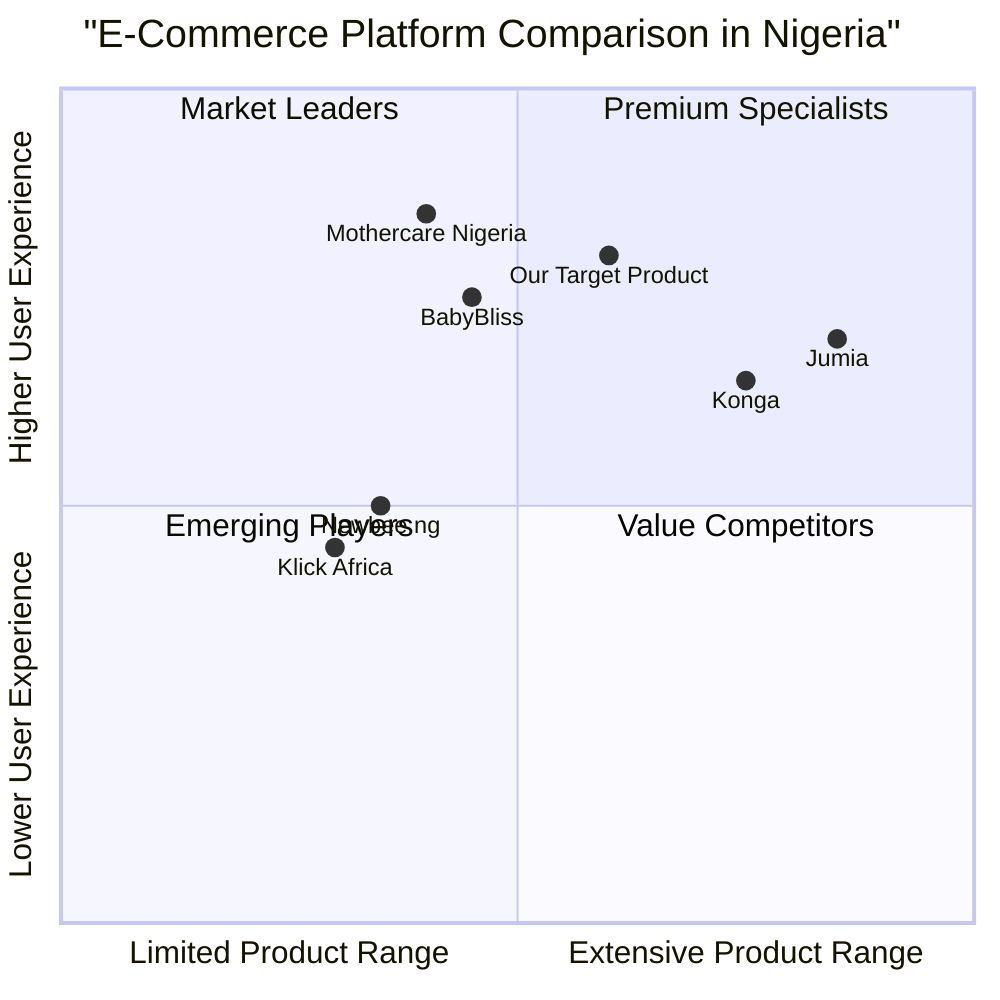
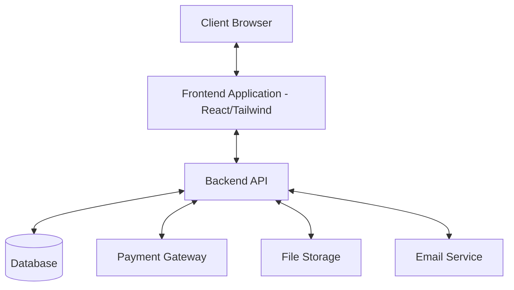

# Product Requirements Document: Dominion Store E-Commerce Website

## Project Information
- **Project Name**: dominion_store_ecommerce
- **Date**: May 13, 2024
- **Document Status**: Draft
- **Last Updated**: May 13, 2024

## Original Requirements
Create a modern e-commerce website for Dominion Store, dealing with mother care, baby needs, adults needs and many more. The website should include a preview of the items with images, with admin dashboard to manage the store (e.g., editing and adding products, new product categories, items and many more). Include a database to manage users' data and integrate payment methods like credit/debit cards and bank transfers (not using Stripe payment gateway as the website is based in Nigeria).

**Store Address**: Ajegunle Street, Asadam Road, Ilorin, Kwara State, Nigeria

**Contact Information**:
- 07066991001
- 07033866666
- 08079772213

## 1. Product Definition

### 1.1 Product Goals
1. Create a user-friendly e-commerce platform specialized in mother care, baby products, and adult needs that provides Nigerian customers with a convenient and secure online shopping experience.
2. Develop a comprehensive admin dashboard that enables efficient inventory and store management for Dominion Store staff.
3. Implement secure and reliable payment processing options tailored for the Nigerian market to boost sales conversion rates.

### 1.2 User Stories

#### Customers
1. As a new mother, I want to easily browse and filter baby products by age group and category, so that I can quickly find appropriate items for my infant.
2. As a returning customer, I want to view my order history and track current deliveries, so that I can stay informed about my purchases.
3. As a busy parent, I want to save favorite items to a wishlist, so that I can purchase them later when I'm ready.
4. As a customer concerned about security, I want multiple secure payment options including bank transfers, so that I can choose my preferred payment method.
5. As a mobile user, I want a responsive website experience, so that I can shop conveniently from my smartphone.

#### Admin Users
1. As a store manager, I want to add new products with detailed descriptions and multiple images, so that customers can make informed purchasing decisions.
2. As an inventory manager, I want to update stock levels and receive low inventory alerts, so that popular products remain available.
3. As a sales administrator, I want to create and manage special promotions and discounts, so that I can drive sales during specific periods.
4. As a customer service representative, I want to view customer orders and manage return requests, so that I can provide efficient support.

### 1.3 Competitive Analysis

| Competitor | Strengths | Weaknesses |
|------------|-----------|------------|
| **Jumia** | • Wide product range • Established brand recognition • Robust logistics network • Multiple payment options | • Sometimes inconsistent delivery times • Mixed customer service reviews • High commission rates for sellers |
| **Konga** | • Strong local market presence • KongaPay integrated payment system • Good user interface • Competitive pricing | • Limited delivery coverage in some areas • Less extensive product range than Jumia • Website performance issues during high traffic |
| **BabyBliss** | • Specialized in baby products • Curated selection of quality items • Expertise in the baby care niche • Educational content for parents | • Higher price points • Limited product categories • Smaller customer base • Less frequent promotions |
| **Mothercare Nigeria** | • International brand recognition • High-quality products • Premium shopping experience • Strong trust factor | • Very high price points • Limited physical presence • Limited product availability at times • Less localized approach |
| **Newbee.ng** | • Focused on baby essentials • Competitive pricing • Fast delivery options • Flexible payment methods | • Limited brand recognition • Smaller inventory selection • Less robust platform features • Limited customer support hours |
| **Klick Africa** | • Mother/child-focused platform • Aggregates multiple businesses • Community-building approach • Founded by mothers (authentic positioning) | • Newer to the market • Still building logistics network • Limited vendor selection • Developing technical infrastructure |

### 1.4 Competitive Quadrant Chart

## 2. Technical Specifications

### 2.1 Requirements Analysis

The Dominion Store e-commerce platform must be built with modern web technologies to ensure a responsive, secure, and scalable shopping experience. The platform must cater to the Nigerian market's specific needs, including appropriate payment gateways and optimized performance for varying internet connectivity strengths.

#### Frontend Requirements
- Responsive design optimized for both desktop and mobile devices
- Fast-loading product pages with image optimization
- Intuitive navigation categorized by product types (mother care, baby needs, adults needs, etc.)
- Product search functionality with filters for categories, price ranges, brands, etc.
- User account management system
- Shopping cart and checkout process
- Order tracking system
- Wishlist functionality
- Product reviews and ratings

#### Backend Requirements
- Secure user authentication and authorization system
- Comprehensive product catalog management
- Order processing and management
- Inventory tracking and management
- Content management for banners, promotions, etc.
- Customer data management compliant with privacy regulations
- Payment processing integration with multiple Nigerian payment gateways
- Analytics and reporting capabilities

#### Admin Dashboard Requirements
- User management (view, create, update, deactivate users)
- Product management (add, edit, remove products and their attributes)
- Category management (create, edit, organize product categories)
- Order management (view, process, track orders)
- Inventory management (stock levels, alerts, adjustments)
- Content management (banners, promotions, homepage featured items)
- Customer management (view customer data, purchase history)
- Sales and performance analytics
- Settings management (shipping options, payment gateways, etc.)

### 2.2 Requirements Pool

#### P0 (Must-Have)
1. Responsive storefront with product catalog organized by categories
2. Product detail pages with multiple images, descriptions, specifications, and pricing
3. Shopping cart and checkout process
4. User registration and authentication system
5. Order management system
6. Admin dashboard for product, order, and user management
7. Payment gateway integration with at least two local Nigerian payment options
8. Basic inventory management
9. Mobile-responsive design
10. Product search functionality
11. Contact information and store location display

#### P1 (Should-Have)
1. Wishlist functionality
2. Product filtering and advanced search
3. User account dashboard with order history and tracking
4. Multiple product images with zoom functionality
5. Product reviews and ratings
6. Sales and discount management system
7. Email notifications for orders and shipping updates
8. Related products display
9. Inventory alerts for low stock items
10. Basic analytics for sales and customer behavior
11. Social media sharing options

#### P2 (Nice-to-Have)
1. Personalized product recommendations
2. Customer loyalty program
3. Advanced analytics dashboard
4. Gift wrapping options
5. Multi-currency support
6. Product comparison feature
7. Live chat customer support
8. Abandoned cart recovery
9. Integration with social media for login/registration
10. Mobile app version
11. Blog section for parenting and product advice
12. Advanced inventory forecasting

### 2.3 UI Design Draft

#### Homepage Layout
- Header: Logo, navigation menu, search bar, user account, wishlist, and cart icons
- Hero section: Featured promotions carousel
- Category navigation: Visual tiles for main product categories
- Featured products section: Best-sellers and new arrivals
- Special offers and promotions section
- Benefits highlight section (fast delivery, secure payment, customer support)
- Newsletter subscription
- Footer: Contact information, about us, policies, social media links

#### Product Category Page
- Breadcrumb navigation
- Sidebar with filtering options (price, brand, age group, etc.)
- Grid/List view toggle
- Sorting options (price, popularity, new arrivals)
- Product cards with thumbnail, name, price, rating, and add-to-cart button
- Pagination or infinite scroll

#### Product Detail Page
- Breadcrumb navigation
- Product image gallery with thumbnail navigation
- Product information: name, price, availability
- Quantity selector and add-to-cart button
- Add to wishlist option
- Product description, specifications, and features tabs
- Customer reviews and ratings section
- Related products carousel

#### Shopping Cart
- List of added items with images, names, prices
- Quantity adjusters
- Remove item option
- Cart subtotal calculation
- Proceed to checkout button
- Continue shopping link

#### Checkout Process
- Step 1: Shipping information
- Step 2: Delivery method selection
- Step 3: Payment method selection
- Step 4: Order review and confirmation
- Order success page with order tracking information

#### Admin Dashboard
- Sidebar navigation with access to all management sections
- Dashboard overview with key metrics and recent activities
- Product management section with list and detail views
- Order management with status updates and filtering
- User management with role-based access control
- Content management for promotions and banners
- Settings section for store configuration

### 2.4 Open Questions

1. What is the expected traffic volume for the website, and what scalability requirements should be considered?
2. Are there any specific Nigerian regulations regarding e-commerce or data privacy that need to be addressed?
3. What is the specific inventory size (number of products and categories) expected at launch?
4. Are there any existing systems or data that need to be migrated to the new platform?
5. What are the specific delivery options and shipping providers to be integrated?
6. Will the store offer international shipping or only deliver within Nigeria?
7. What is the preferred technology stack for development?
8. What is the timeline for development and launch?
9. Who will be responsible for content creation (product descriptions, images, etc.)?
10. What is the budget allocation for third-party services like payment gateways, hosting, etc.?

## 3. Technical Architecture and Implementation

### 3.1 System Architecture

The system will follow a modern web architecture pattern using React for the frontend with Tailwind CSS for styling, and a backend RESTful API structure:

### 3.2 Technology Stack

#### Frontend
- **Framework**: React.js for component-based UI development
- **Styling**: Tailwind CSS for responsive design
- **State Management**: Redux for application state management
- **API Communication**: Axios for HTTP requests
- **Image Optimization**: Next.js Image or similar for optimized loading

#### Backend
- **API Framework**: Node.js with Express
- **Database**: MongoDB for flexible schema design or PostgreSQL for relational data
- **Authentication**: JWT (JSON Web Tokens) for secure authentication
- **File Storage**: AWS S3 or local storage with CDN integration
- **Email Service**: SendGrid or similar email delivery service

#### Payment Integration
- **Primary Options**: PayStack, Flutterwave, and Interswitch Webpay
- **Alternative Options**: Remita, VoguePay, and direct bank transfer processing

### 3.3 Database Schema Overview

#### Core Entities

1. **Users**
   - UserID (Primary Key)
   - Email
   - Password (hashed)
   - First Name
   - Last Name
   - Phone Number
   - Address Information
   - Account Creation Date
   - Last Login
   - Role (Customer/Admin/Manager)

2. **Products**
   - ProductID (Primary Key)
   - SKU
   - Name
   - Description
   - Categories (Foreign Keys)
   - Price
   - Sale Price
   - Stock Quantity
   - Images (array of URLs)
   - Specifications (JSON)
   - Brand
   - Weight
   - Dimensions
   - Created Date
   - Updated Date
   - Status (Active/Inactive)

3. **Categories**
   - CategoryID (Primary Key)
   - Parent Category (Foreign Key)
   - Name
   - Description
   - Image
   - Display Order
   - Status (Active/Inactive)

4. **Orders**
   - OrderID (Primary Key)
   - UserID (Foreign Key)
   - Order Date
   - Status
   - Payment Method
   - Payment Status
   - Shipping Method
   - Shipping Cost
   - Subtotal
   - Discount
   - Total
   - Billing Address
   - Shipping Address
   - Notes

5. **Order Items**
   - OrderItemID (Primary Key)
   - OrderID (Foreign Key)
   - ProductID (Foreign Key)
   - Quantity
   - Price at Purchase
   - Subtotal

6. **Wishlists**
   - WishlistID (Primary Key)
   - UserID (Foreign Key)
   - Created Date
   - Updated Date

7. **Wishlist Items**
   - WishlistItemID (Primary Key)
   - WishlistID (Foreign Key)
   - ProductID (Foreign Key)
   - Added Date

8. **Product Reviews**
   - ReviewID (Primary Key)
   - ProductID (Foreign Key)
   - UserID (Foreign Key)
   - Rating
   - Comment
   - Date
   - Status (Published/Hidden)

### 3.4 Security Considerations

1. **Authentication and Authorization**
   - Implement secure JWT-based authentication
   - Role-based access control for admin functions
   - Strong password policies with regular expiration

2. **Data Protection**
   - Encrypt sensitive user data
   - Implement HTTPS for all connections
   - Regular security audits and penetration testing

3. **Payment Security**
   - PCI DSS compliance for handling payment information
   - Use secure, established payment gateways
   - Never store credit card details locally

4. **General Security**
   - Protection against common vulnerabilities (XSS, CSRF, SQL injection)
   - Rate limiting to prevent brute force attacks
   - Regular security patching and updates

### 3.5 Deployment Considerations

1. **Hosting Options**
   - Cloud-based hosting on AWS, Google Cloud, or Azure
   - Consider Nigerian data center locations for reduced latency
   - CDN integration for static assets to improve loading times

2. **Performance Optimization**
   - Implement caching strategies
   - Optimize images and static assets
   - Database indexing for improved query performance
   - Consider progressive web app features for better mobile experience

3. **Scalability**
   - Horizontal scaling capabilities for handling traffic spikes
   - Database sharding or replication as the user base grows
   - Load balancing for distributed traffic

## 4. Implementation Timeline and Milestones

### 4.1 Development Phases

#### Phase 1: Foundation (Weeks 1-4)
- Project setup and repository creation
- Database schema implementation
- Basic user authentication system
- Core product catalog functionality
- Basic admin dashboard

#### Phase 2: Core Functionality (Weeks 5-8)
- Shopping cart and checkout process
- Payment gateway integration
- Order management system
- User profile management
- Basic search and filtering

#### Phase 3: Enhanced Features (Weeks 9-12)
- Advanced product filtering and search
- Wishlist functionality
- Product reviews and ratings
- Content management for banners and promotions
- Email notification system

#### Phase 4: Optimization and Launch (Weeks 13-16)
- Performance optimization
- Security testing and hardening
- User acceptance testing
- Bug fixes and refinements
- Production deployment

### 4.2 Testing Strategy

1. **Unit Testing**
   - Test individual components and functions
   - Automated tests for critical business logic

2. **Integration Testing**
   - Test interactions between components
   - API endpoint testing
   - Database integration testing

3. **User Interface Testing**
   - Cross-browser compatibility testing
   - Responsive design testing
   - Usability testing

4. **Performance Testing**
   - Load testing for concurrent users
   - Stress testing for system limits
   - Page load speed optimization

5. **Security Testing**
   - Vulnerability scanning
   - Penetration testing
   - Payment process security validation

## 5. Conclusion and Recommendations

The Dominion Store e-commerce website will provide a comprehensive online shopping platform for mother care, baby needs, and adult products with robust admin capabilities and secure payment processing tailored for the Nigerian market.

Key success factors include:

1. **Responsive Design**: Prioritizing mobile responsiveness is essential as most Nigerian online shoppers access e-commerce sites via smartphones.

2. **Payment Options**: Implementing multiple payment gateways that are trusted in Nigeria will increase conversion rates and customer trust.

3. **Performance Optimization**: Optimizing for varying internet speeds and implementing progressive loading techniques will ensure a good user experience across different network conditions.

4. **Local Context**: Addressing Nigerian e-commerce challenges such as delivery logistics, trust issues, and payment preferences will differentiate Dominion Store from competitors.

5. **Customer Support**: Integrating multiple contact channels and clear customer support processes will help build trust in the platform.

By implementing this PRD, Dominion Store can establish a competitive e-commerce presence in the Nigerian market, offering a superior shopping experience for customers seeking mother care, baby products, and adult needs while providing store administrators with powerful tools to manage their online business effectively.
